# lab1 : the environment of openEuler
## jiao hongbao 
----------------------------------------

## create the Huawei cloud service

After following the guide of Laboratory manual, i have create the Huawei cloud service successfully, and i can connect to the service by 
`ssh root@<my public net IP>`
command in my alacritty terminal.

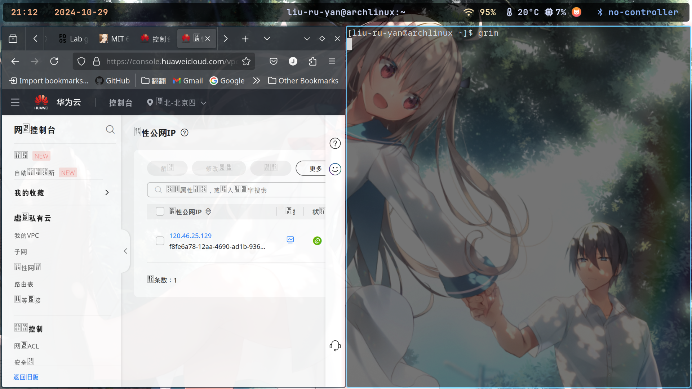

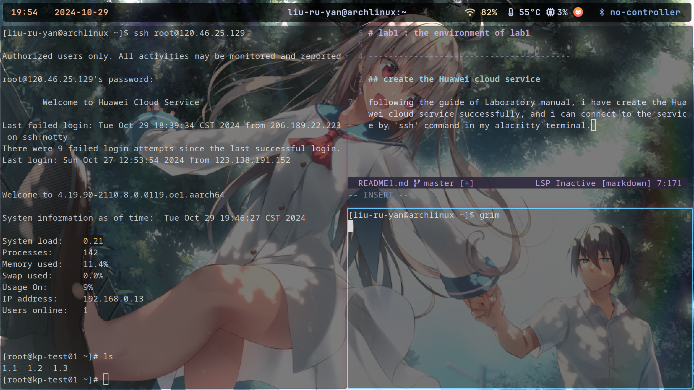

For now, i have complete the environment's creation.

## complete the lab 1.1

### question 1
After copy the origin code from the manual to my openEuler(/root/1.1/1-1.c  actually), i use the command: 

`gcc 1-1.c -o 1-1`

to create an execuable-file named 1-1, then i use the command:

`./1-1`

to impement my program many times, like this:

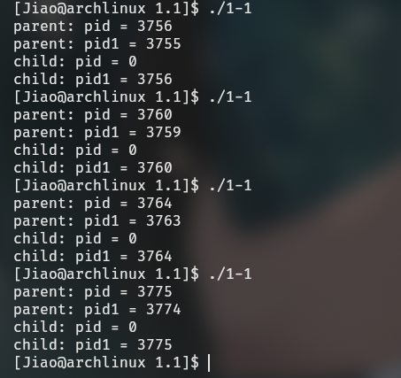

while remove the `wait(NULL)`, the result is:

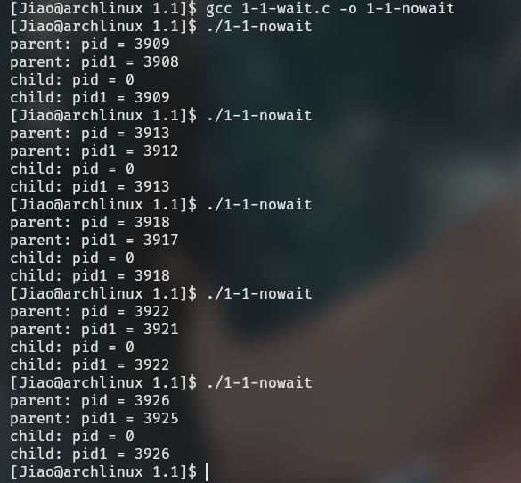

Let's analysis what is the difference between these two cases.

The function of wait can make the parent process always terminated after the child process, if we remove the wait(NULL), parent process maybe terminated before the child process is terminated, it will cause the child process become a zomibe. 

This change will change the output sequencial theoretically, but because the wait(NULL) is the last line to be execute in parent process, so the output do not looks different(but there are some changes exactly). 

### question 2 

#### 2.a

I define a global variable named global, initialize it as 2004. Then i change is value to 24 in child process and 88 in parent process. 

Here is the result:

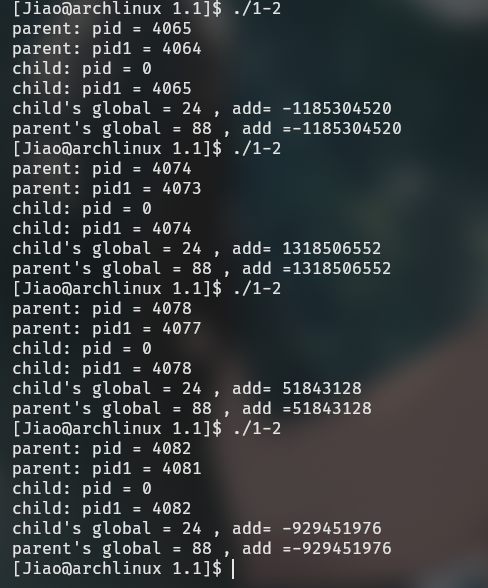

The result is, the *'value'* in parent process and child process is different.

Because the fork command create a new process, it is a copy of parent, they have same status, but the variable can't not share, so they will change the value seperately.

#### 2.b

In this case, i add a line

`global = 2004+pid;`

before the return, here is the result:

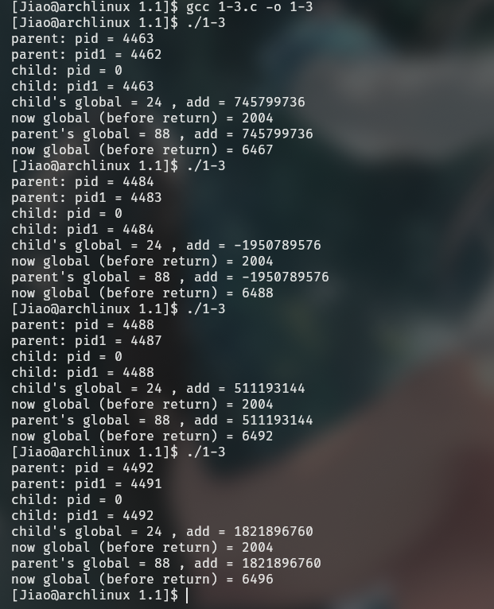

We can find that the line of code above have been executed both in parent and child process, and because the variable are not shared, so output the value before return is different.

#### 2.c

I modify the code to use the function of `system` and `execl` in the child process, one of them use `system` to call the execuable-file `system_call`, the other use `execl` to call the execuable-file `execl`.

And here is the result:

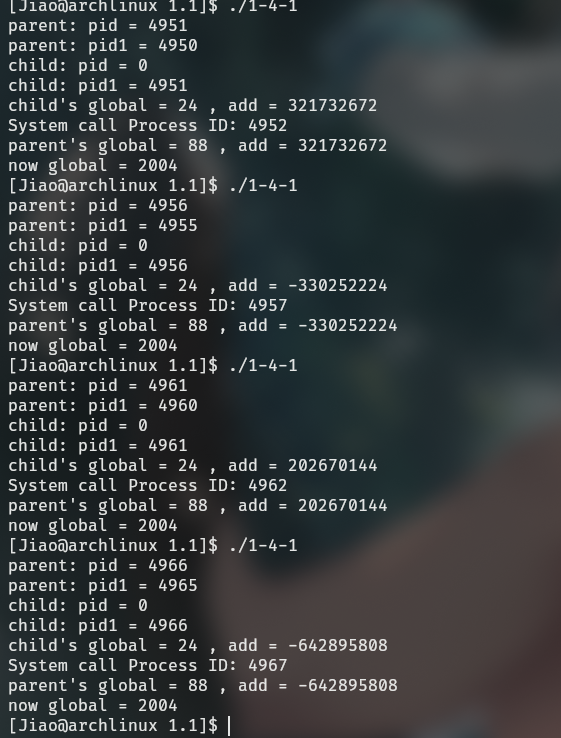

So we can find the two has been excuted normally.

## complete the lab 1.2

### thread
For this, i create a .c file, inside this i create two thread, each thread have a loop with 5001 times, in thread1 execute 

*`global++;`*

in thread2 execute 

*`global-=2`  (global is initialize as 2024)*.

Here is the result:

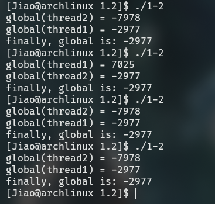

We can find that the result is different.

Because the operate is not atomtic, there is a race condition, it will cause the result is different due to the schedule of the CPU, and the schedule is invisiable and unpredictable, it cause the result is *"randomly"*.

So, to make the result relable, i add a mute lock to this program, like this:

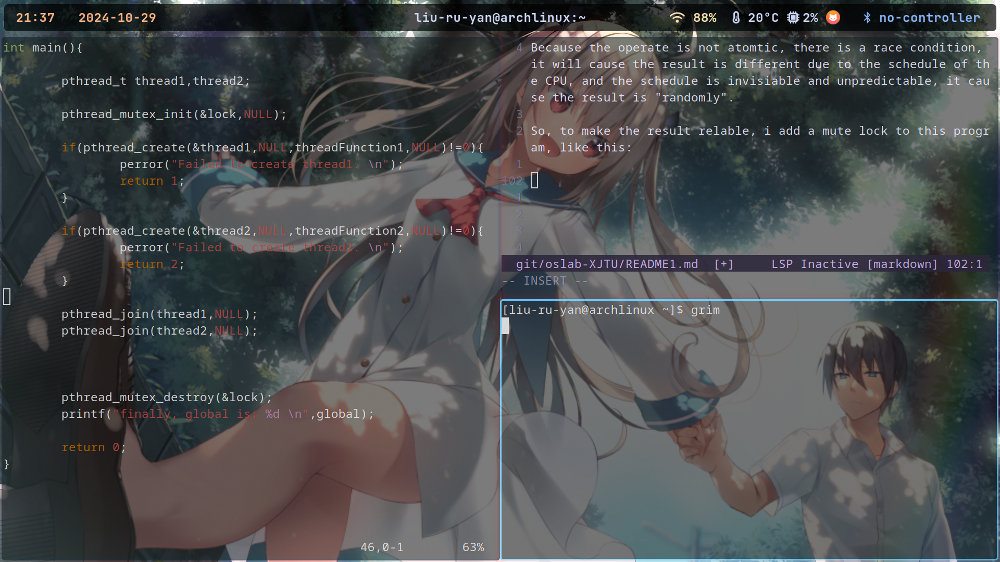

and run it again, here is the result:

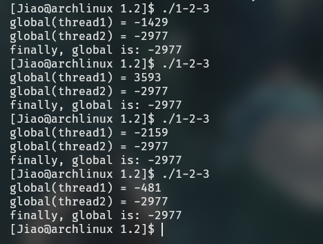

Now, the result is predictable.

### system and exec 

Use the thread to execute the *`system_call`* by *system* and *exec*, i create two version of code.

And here are the result:

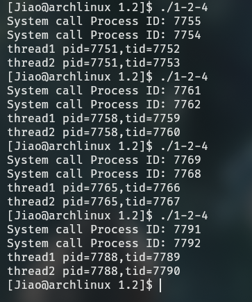

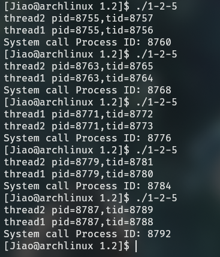

We can find that, the result of the two is different. In the thread, we use exec to execute the *`system_call`*, then may will not output 

*`thread2 pid=??, tid=??`*

that is because, if we use *exec* in a thread, it will replace this process, it will change the remain process.

## complete the lab 1.3

In this lab, i create two threads in the main function, and one thread is to execute 

*`shared_value++;`* 

for 5000 times, the other is to execute 

*`shared_value-=2;`*

for 5000 times.

In this program, i use the lock to complete the mute and *sync.*.

Here is the result:

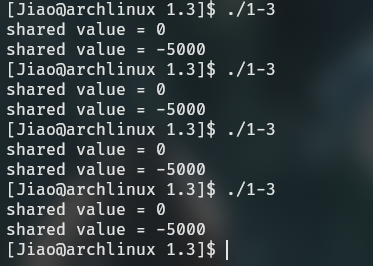

We can find result is standable, the lock goes correctly.

