# lab2 the communication between processes and the management of memeory

jiao hongbao

-----------------------------------------------------

## soft interrupt communication of the process

*The first step* of the lab is using command 

*`man`* 

to check the manual of basic use of some system call, like: *fork, kill, signal, sleep, exit. *

Here is the result of run 

*`man fork`* 

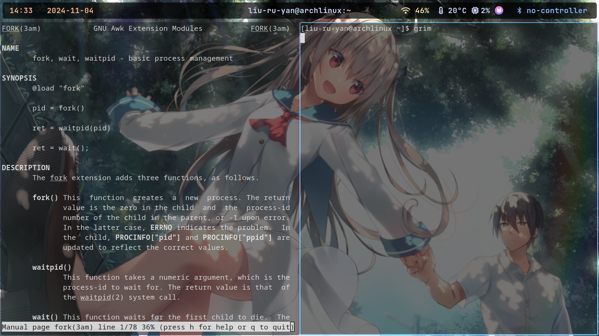

and another version of *kill*

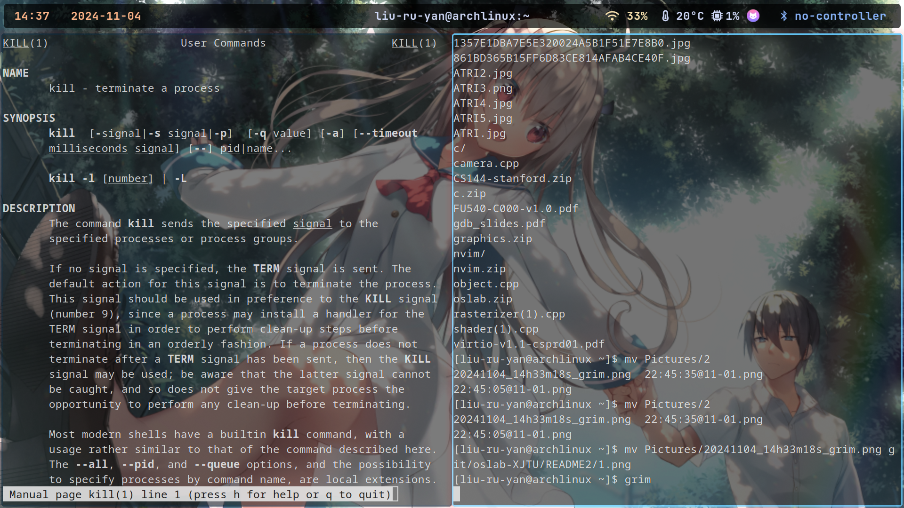

*The second step is to create the soft interrupt program as the flow chart.*

")

")

")

At first, I define parent and alrm_handler function, it is used to send signal to both two child process, 16 for child1, 17 for child2, the alrm_handler it will be used when parent process does not receive the signal from keyboard automaticly.

The function of child1 and child2 is used to print message when it is used by *singal()*.

Then create two processes in the parent process, use 

*`alarm(5);`*

*`signal(SIGALRM, alrm_handler);`*

to wait 5 seconds; At the same time, use

*`signal(SIGQUIT, parent);`*

to wait the keyboard's input.

If the keyboard's input is received in 5 seconds, it will use the function parent, to send singal 16 to child1 and 17 to child2; if not, after 5 second it will be used automaticly.

In child1(for example), I use *pause()* to make child1 to wait for signal; When receive the signal 16 from parent, the child1 function will be used; Additionally, I use the *signal(SIGQUIT,SIG_IGN);* to ignore the SIGQUIT signal for child1 process.  

So, after 5 seconds or input the signal, all process will be killed.

The result is here:

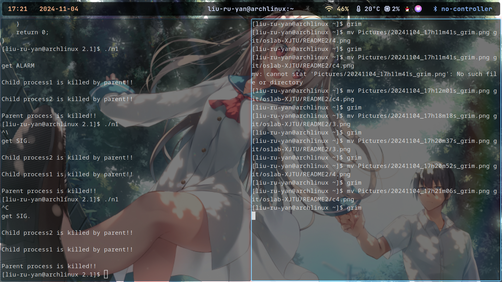

There are some questions.

1. When parent process send signal to child, how to make sure child is wait for it?

After child process corrspends to signal, send SIGUSR signal to parent process, interrupt pause of parent process, then, parent execute the instruction of send signal.  

2. How to hold the process to wait for signal?

The answer will be pause. By using pause, the process can do nothing but waitting for signal, after receive one, it comes go.

## report of the soft communication interrupt lab

1. I think the result will be: the child processes are killed by parent process, and then the parent process exit itself.

2. The result is as same as i think, whatever signal the parent process get (SIGQUIT or SIGALRM or SIGINT), always the child processes are killed by parent process, and then the parent process exit itself. The screenshot have been showed before.

3. After change it to alarm interrupt, seems there is not different.

4. 4 times in my program. It is used to send signal to two child process, to terminate child process(2 times) and childs send to parent to tell him "you can send signal now". After executed, two child processes will output message on screen and then exit.

5. In process, we can use *exit()* or *return ;* to quit itself. Quit process by itself can provide that itself is executed well; Quit process by signal or others, it will be flexiable.

-----------------------------------------------------------------

## communication with pipe

The result of InPipe with no lock:

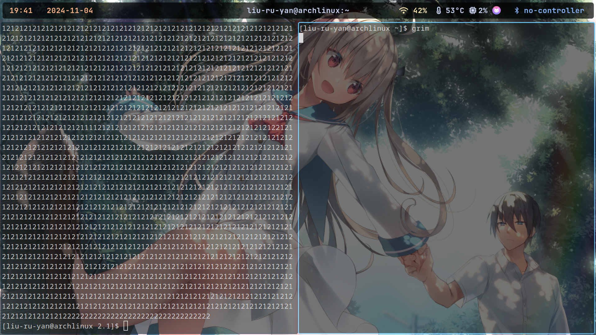

Here is the result InPipe with lock:

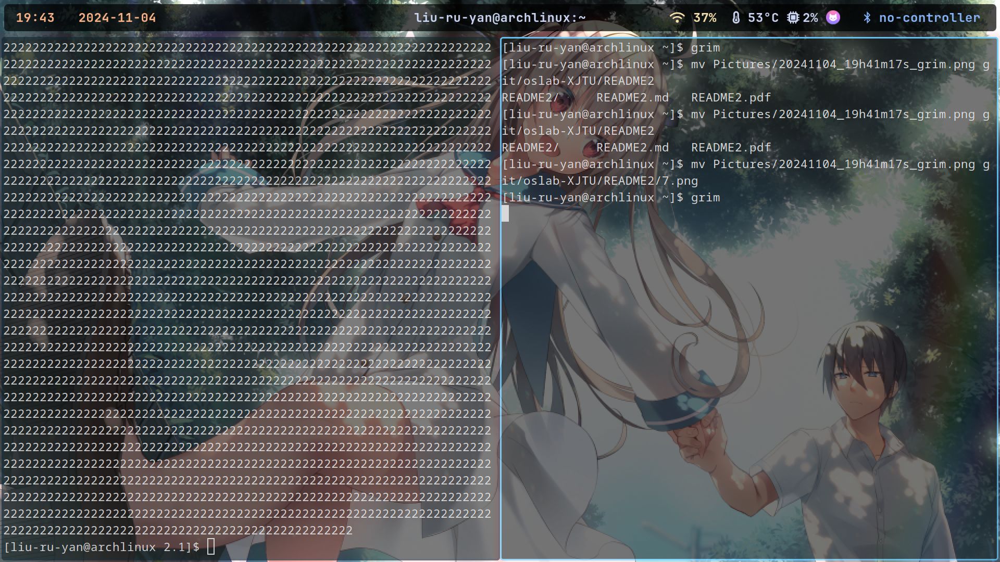

1. I think the result with lock will be perfectly output all the '1' first, and then '2'; the result without lock will be unordered.

2. The result of InPipe with lock just as I think before, but the without lock one is almost output '12' alignment, I think it may due to the schedule of CPU.

By the way, I tried just give lock to child2, the result will be 

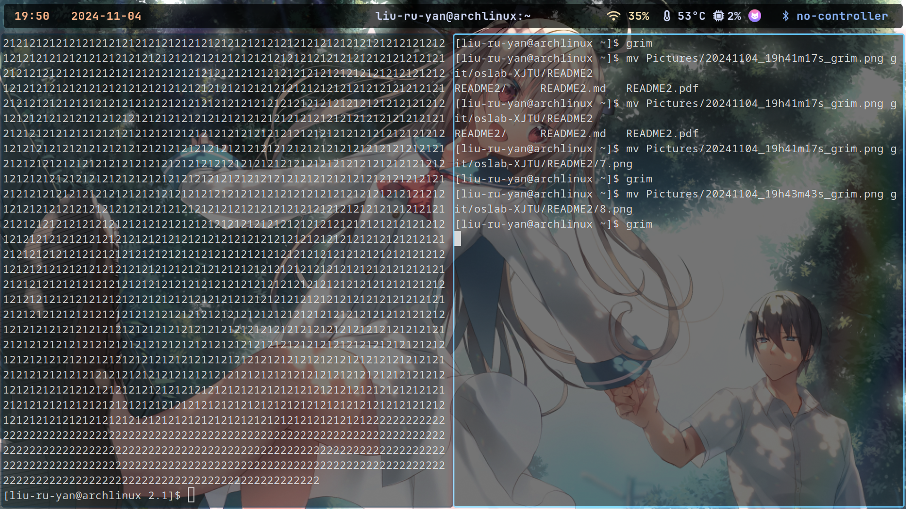

the result is simmilar to with no lock.

It is maybe without (two) lock, the process without lock will write directly and doesn't care about the other, cause two process write alternately.

3. By locking. Without lock, the process will write alternately, which cause the output unorder.

-----------------------------------------------------------------------------------------

## background knowledges 

1. FIFO

The replacement function of FIFO is: when we need to load a new page in cache, but the cache has full, so we must choose a victim page to replace it to the new page that we wanted.

So how to decide which page in cache to be replaced?

FIFO algorithm is a function to realize the requirement above.

When we need to choose a victim to be replace, it will be the oldest one.

In this function, we just need to record the time when it was loaded in cache(actually, this is not necessary even).

2. LRU

Least Recently Used is another way to fire this. When we need to choose the victim, it will be the least Recently Used one. That mean, we need to record when each page was used, and find the least used one.

### RESULT

When the input as follow(FIFO):

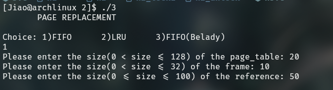

The result is:

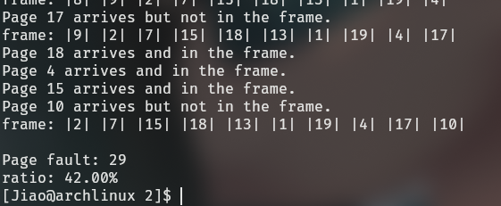

When the input as follow(LRU):

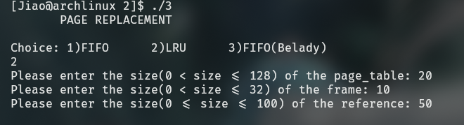

The result is:

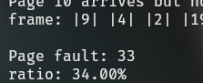

So, the result conclution that the LRU algorithm is better than FIFO in Hit-rate, but it will cause a extra overhead(because we need record the time-stamp of each page).

When we come to belady situation:

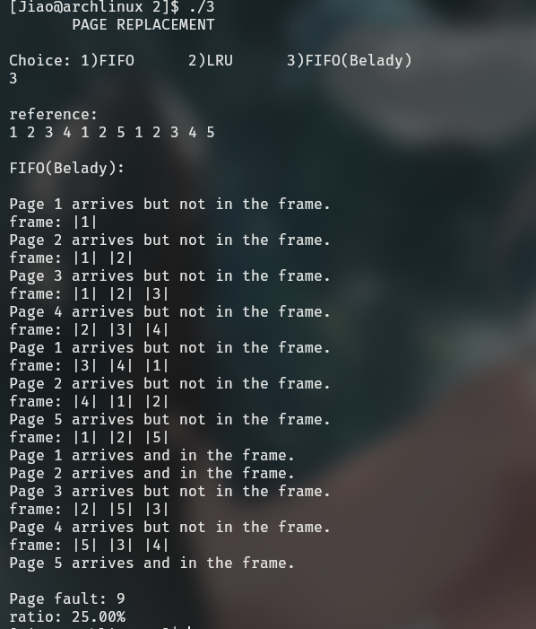

