# lab 3 : EXT2 like file-system

Jiao hongbao

2024/11/27

---------------------------------------------------------

## realize functions

in this lab, we need to achieve a ext2-file-system, successfully receive some simple command, and response correctly.

### function realizing

to achieve this file-system, I deivide this problem into four layers, they are: **fundamental, IO_operation, command_line, userinterface**.

I define the `.h` files, to declare all functions we need in the `include/` directory, they are:

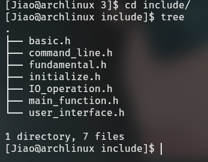

I define the modulization files in the `src/` directory, there are:

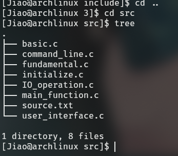

Then I define a `CMakeLists.txt`, to manage all these files.

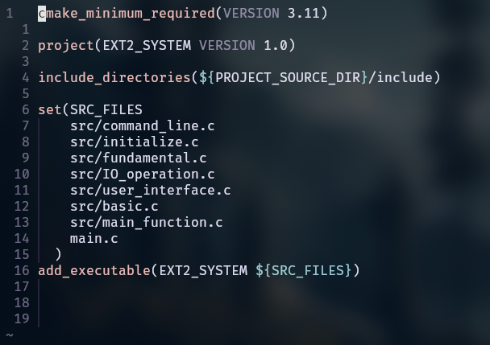

----------------------------------------------

finally, I build all this project in the `build/`

## result show

### login

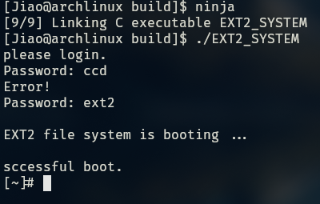

### ls 

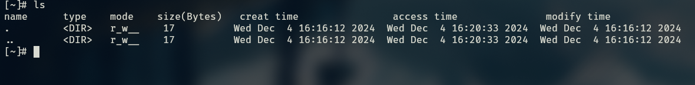

### create 

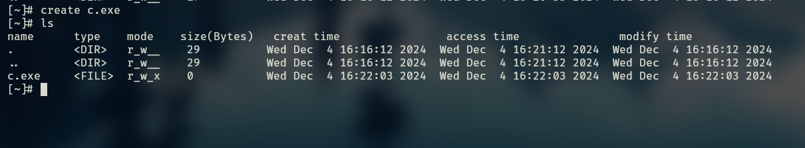

### delete

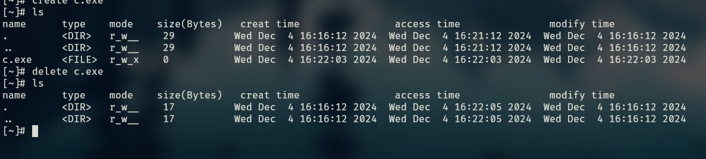

### cd

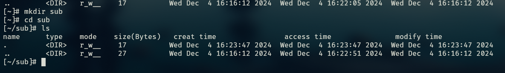

### open close write read

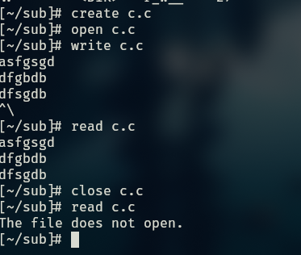

### check and format 

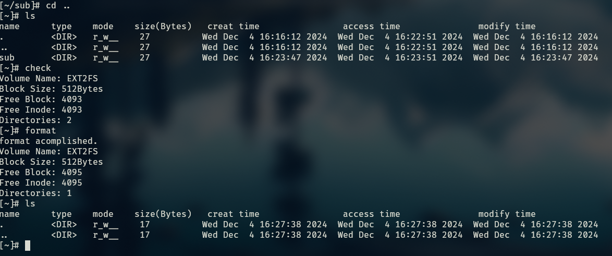

### password

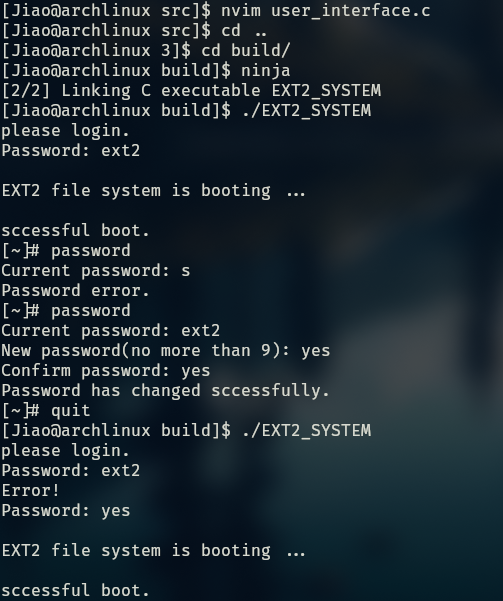

### time

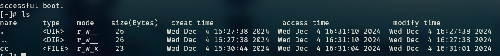

### protection

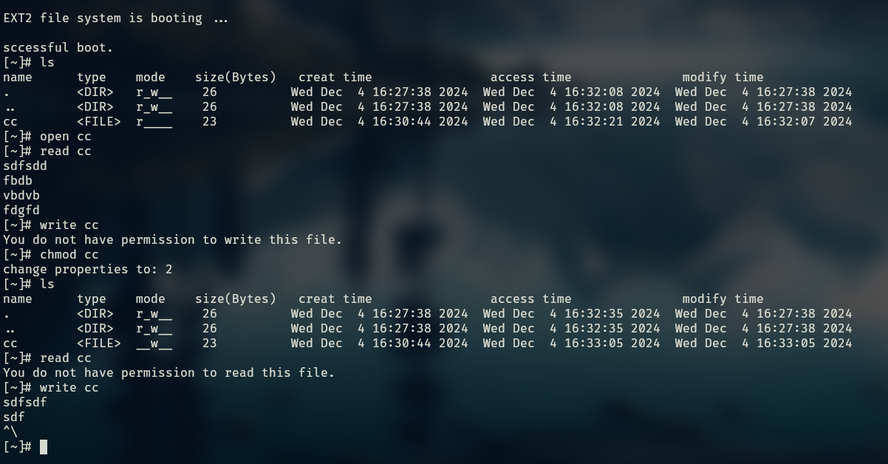

