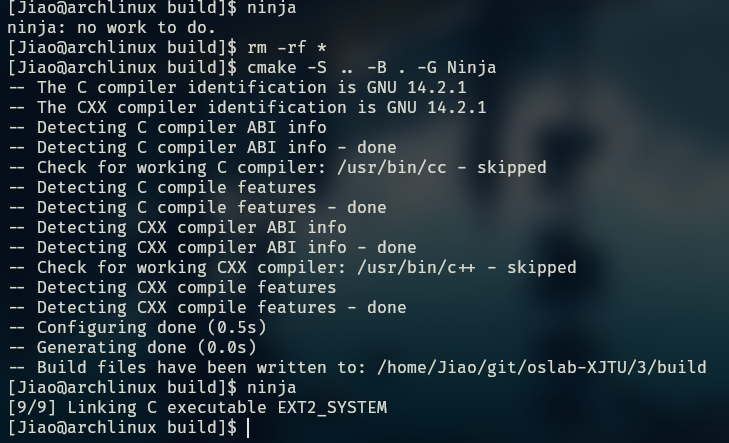

# lab 3 : EXT2 like file-system

Jiao hongbao

2024/11/27

---------------------------------------------------------

## realize functions

in this lab, we need to achieve a ext2-file-system, successfully receive some simple command, and response correctly.

### function realizing

to achieve this file-system, I deivide this problem into four layers, they are: **fundamental, IO_operation, command_line, userinterface**.

I define the `.h` files, to declare all functions we need in the `include/` directory, they are:

I define the modulization files in the `src/` directory, there are:

Then I define a `CMakeLists.txt`, to manage all these files.

----------------------------------------------

finally, I build all this project in the `build/`

---------------------------------------------------------

allow files' architecture is:

## result show

### login

### quit-log(relogin)

### ls 

### mkdir 

### create 

### rmdir(delete folder/directory)

### delete

### cd

### open close write read

### overwrite

### last access time and modify time 

last access time and modify time:

### `chmod` and protection 

### check and format 

### password

relogin:

### `quit` (quit this program) and `quit-log` (quit crruent user)

`quit`

`quit-log`

